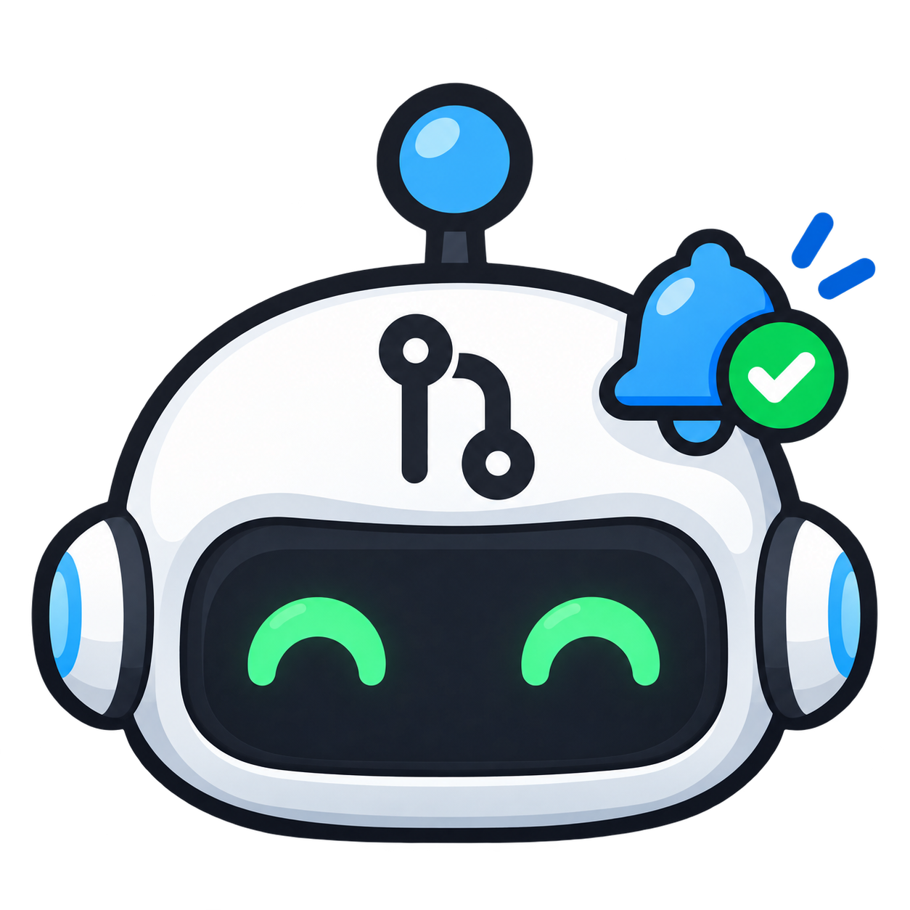

# pr-notify



A macOS menu bar app that watches your GitHub PRs through the `gh` CLI and sends a notification when one needs you. Clicking a notification opens the PR.

## Requirements

- macOS 12+ with Xcode command line tools (`swiftc`, `codesign`)
- Python 3.9+
- [`gh`](https://cli.github.com) installed and logged in (`gh auth login`)

## Install

```
git clone <this repo> && cd pr-notify
python3 -m pr_notify install-agent
```

This builds `~/.local/share/pr-notify/PRNotify.app`, starts it, and registers a launchd login item so it starts at every login and restarts if it dies.

Then allow notifications: **System Settings → Notifications → PRNotify → Allow**. If PRNotify isn't listed yet, run `python3 -m pr_notify install-notifier` to trigger the permission prompt. Check with:

```
python3 -m pr_notify test-notify
```

To remove it: `python3 -m pr_notify uninstall-agent`.

## The menu bar app

The robot icon appears in the menu bar. A number next to it is how many of your own non-draft PRs need you (others' PRs and your drafts are not counted, though they are still listed in the menu). Click it for:

- **Health and last run**, e.g. "Healthy / Last run: 2m ago (85 open PRs)". If the latest poll failed, it also shows when the last success was.
- **My PRs** and **Others' PRs**: every open PR, each split into **Open** and **Draft** folders, e.g. "My PRs (41, 4 need you)". PRs that need you are listed first, marked with ●, and say why. Click a PR to open it on GitHub. "My PRs" are ones you authored; "Others' PRs" are ones where you're a reviewer.
- **Poll now** (⌘R), **Open log**, **Quit PRNotify**.
- **Open Notification Settings…** appears when macOS is blocking notifications.

The icon turns into a warning triangle when:

- the last poll failed (the menu shows the error),
- no poll has succeeded for about three intervals, or
- macOS is blocking PRNotify's notifications.

The app polls every 120 seconds and again after your Mac wakes from sleep. A poll that hangs is killed after 3 minutes. To change the interval, edit `INTERVAL` in `pr_notify/agent.py` and re-run `install-agent`.

## What notifies

The first poll records a baseline silently, so you aren't flooded with old activity. After that, only changes notify. Notifications for one PR are combined into a single banner, and a new one replaces the previous banner for the same PR. Each event notifies once: it is remembered for as long as the PR stays open, so a condition that clears and comes back (e.g. CI failing again on the same commit) doesn't notify twice. A new push or comment is new activity. A notification that fails to send is retried on the next poll.

**On your PRs:** approved, changes requested, a review with a body, new comments (conversation or inline), CI failed, merge conflict.

**Menu only, no notification:** ready to merge, and needs a reviewer (review required and nobody requested, e.g. after a push dismissed approvals). They show up flagged in the menu and count toward the badge.

**On others' PRs:** your review was requested (including re-requests), the author replied in a thread you started or commented in, new commits were pushed since your review.

Bots, your own activity, and body-less "commented" reviews (their inline comments are reported as comments instead) are ignored. "CI failed" uses GitHub's overall check status, so it includes non-required checks.

The ● flags in the menu show current conditions: review requested, CI failed, merge conflict, ready to merge, needs a reviewer.

## Terminal commands

```
python3 -m pr_notify status            # print what needs you right now
python3 -m pr_notify once              # poll once
python3 -m pr_notify once --dry-run    # print what would notify; change nothing
python3 -m pr_notify once --quiet      # update state without a desktop notification
python3 -m pr_notify watch             # poll in the foreground (not needed with the app)
python3 -m pr_notify reset             # forget state; next poll re-baselines
python3 -m pr_notify install-notifier  # rebuild the app and request permission
python3 -m pr_notify test-notify
```

## Files

| Path | Purpose |
|---|---|
| `~/.local/share/pr-notify/PRNotify.app` | Menu bar app and notification helper (built from `helper/PRNotify.swift`) |
| `~/.local/state/pr-notify/state.json` | Event keys seen at the last poll (dedup) |
| `~/.local/state/pr-notify/status.json` | Last run and health, read by the menu bar |
| `~/.local/state/pr-notify/app.log` | Poll output and errors |
| `~/Library/LaunchAgents/com.local.pr-notify.plist` | Login item |
| `assets/icon.png` | App and menu bar icon; replace it and re-run `install-agent` |

## Troubleshooting

- **No notifications:** check System Settings → Notifications → PRNotify, then `test-notify`.
- **Warning triangle with a `gh` error:** run `gh auth status`; occasional GitHub 502s are retried automatically.
- **Nothing happens after install:** `launchctl print gui/$(id -u)/com.local.pr-notify` and `app.log`.
- **Re-baseline after a long gap:** `python3 -m pr_notify reset`.

## Tests

`python3 -m unittest discover -s tests`
